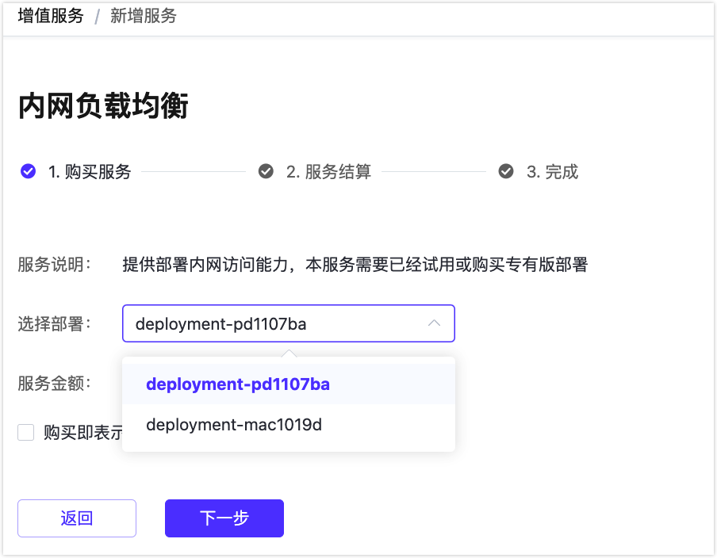
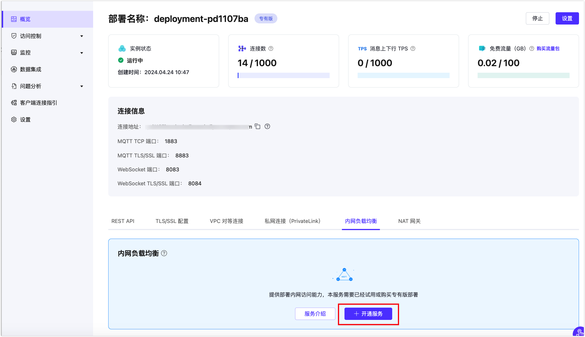

# 内网负载均衡

::: warning 注意
该功能为专有版功能，购买该服务前需要创建专有版部署。
:::

内网负载均衡是一种在内网中对流量进行按需分发的服务，通过将流量分发到不同的后端服务器来扩展应用系统的吞吐能力，并且可以消除系统中的单点故障，提升应用系统的可用性。开启了内网负载均衡之后，您的其他服务应用就可以通过内网地址来连接到 EMQX 部署。

在开始之前，您需要完先完成 [对等连接的创建](../deployments/vpc_peering.md)，下文提到的 IP 均指资源的内网 IP。

## 服务开通

您可以在顶部菜单栏 - **增值服务** 选择内网负载均衡卡片或者部署概览底部标签栏选择开通内网负载均衡服务。

增值服务是和您购买的部署关联的，在购买专有版部署之后，才可以开通相关的增值服务，请留意服务的相关说明。如果您购买了多个部署，请选择您需要创建服务实例的部署。

开通完成之后，可以查看服务列表，这里将显示您所购买的同类型的所有增值服务。或者您也可以直接前往查看在部署下的增值服务。

除了在增值服务中心开通服务之外，您在部署下的功能中，也可以看到能提供服务的入口，（不同的增值服务入口会不一样）。在这里可以直接开通此服务，流程和在增值服务中心开通一致。

## 服务使用

完成内网负载均衡增值服务购买后，您可在相应部署概览处看到内网负载均衡创建状态，等待创建完成。

当内网负载均衡的状态为 running 后，您可以将完成对等连接的 VPC 下终端通过内网地址的内网 IP 连接到该部署，连接端口和公网连接端口一致：mqtt 端口为 1883，websocket 端口为 8083。