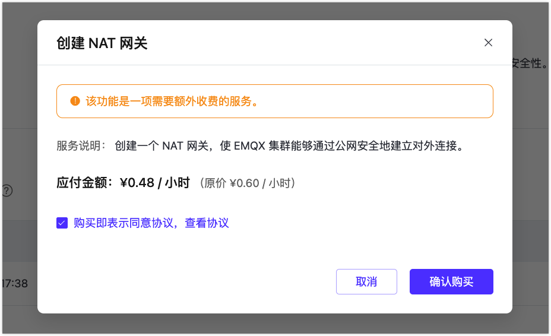
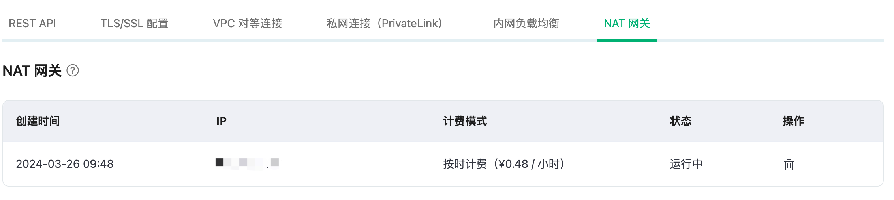
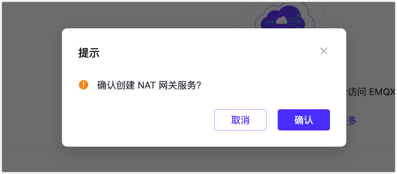
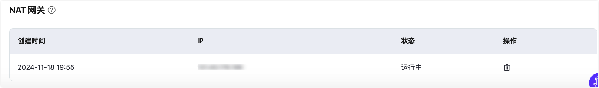

# NAT 网关

::: warning 注意

该功能为专有版和旗舰版功能，购买该服务前需要创建专有版或旗舰版部署。

:::

网络地址转换（NAT）网关提供网络地址转换服务。在 NAT 网关启用之前，专有版/旗舰版部署的一些功能（如扩展认证和数据集成）无法访问公网资源。订阅后，您可以通过公网地址进行访问。

## 在专有版部署中启用 NAT 网关

1. 在 EMQX 平台控制台中，进入您的专有版部署。

2. 点击左侧菜单中的**网络管理**，导航到 **NAT 网关**区域，然后点击 **+NAT 网关**。

3. 在弹出的对话框中，勾选**购买即表示同意协议**，并点击**确认购买**。

   

4. 购买服务后，您可以在页面上查看创建状态，等待创建过程完成。

   当 NAT 网关状态变为`运行中`时，该部署即可访问公网资源。

   

## 在旗舰版部署中启用 NAT 网关

1. 在 EMQX 平台控制台中，进入您的旗舰版部署。

2. 点击左侧菜单中的**网络管理**，导航到 **NAT 网关**区域，然后点击 **+NAT 网关**。

3. 在弹出的对话框中，点击**确认**开始创建流程。

   

   您可以在部署概览页面上查看 NAT 网关的创建状态，等待创建过程完成。当 NAT 网关状态变为 `Running` 时，该部署即可访问公网资源。

   

