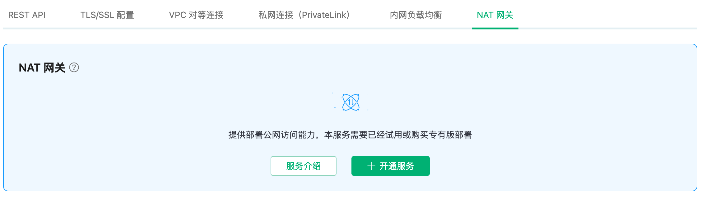

# NAT 网关

::: warning
该功能为专业版功能，需要创建专业版部署开通服务。
:::

NAT 网关可以提供网络地址转换服务，为专业版部署提供访问公网资源的能力，无需 VPC 对等连接。

在开始之前，您需要完成以下操作：
* 已经在 EMQX Cloud 上创建专业版部署(EMQX 集群)。

## 服务开通

您可以在顶部菜单栏 - `增值服务` 或者部署概览底部选择开通 NAT 网关服务。

## 服务使用

完成 NAT 网关增值服务购买后，您可在相应部署概览处看到 NAT 网关创建状态，等待创建完成。

当 NAT 网关的状态为 running 后，该部署便可访问公网资源。

## 测试

### 未开启 NAT 网关访问公网资源

### 开启 NAT 网关后访问公网资源

