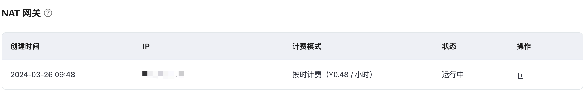

# NAT 网关

::: warning
该功能为专业版功能，需要创建专业版部署开通服务。
:::

NAT 网关可以提供网络地址转换服务，为专业版部署提供访问公网资源的能力，无需 VPC 对等连接。

在开始之前，您需要完成以下操作：
* 已经在 EMQX Cloud 上创建专业版部署(EMQX 集群)。

## 在专有版部署中启用 NAT 网关

1. 在 EMQX 平台控制台中，进入您的专有版部署。

2. 点击左侧菜单中的**网络管理**，导航到 **NAT 网关**区域，然后点击 **+NAT 网关**。

3. 在弹出的对话框中，勾选**购买即表示同意协议**，并点击**确认购买**。

   

4. 购买服务后，您可以在页面上查看创建状态，等待创建过程完成。

   当 NAT 网关状态变为`运行中`时，该部署即可访问公网资源。

   