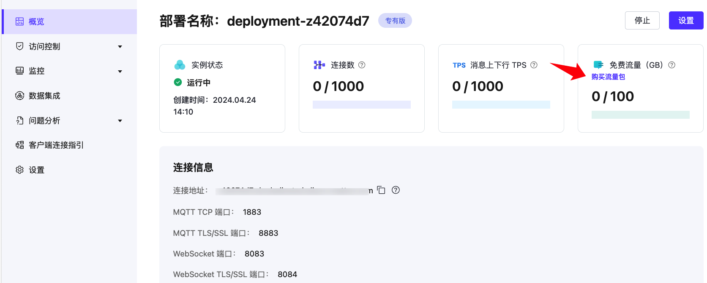
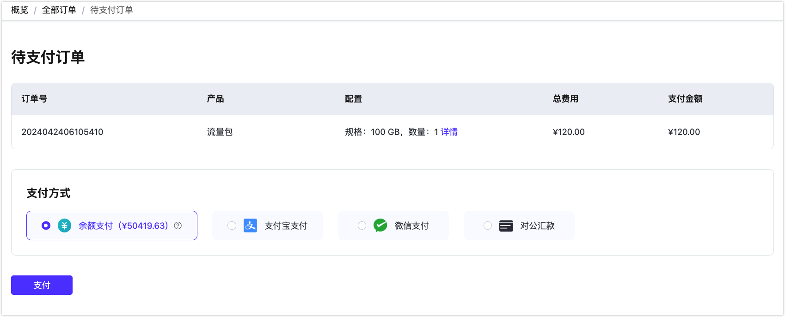

# 流量包

EMQX Platform 的定价模式是采用连接数作为主要计价衡量因素，相较于按收发消息数来为衡量单位计价会更加经济实惠，不会出现因为消息量飙升导致消费也突然升高的情况。

随着客户使用场景的逐渐丰富，我们发现低接入量高流量消耗的场景也十分常见，为了帮助节省流量费用，我们推出不同规格的流量包，用户可以根据自己的实际情况选择购买。

::: tip

- 流量包为所有部署提供服务，即所有部署共享流量包。
- 流量包适用范围：按量计费部署、包年部署。**流量包不能抵消 Serverless 部署产生的流量。**
- 每个部署流量优先使用免费流量，超出部分开始在流量包中计算。
- 若有流量包叠加的情况，优先使用到期的日期在前面的流量包。

:::

## 流量包规格

目前有 **100 GB** 、 **1 TB** 两种规格的流量包。

每种流量包的单次购买上限为 10 个。

## 流量包计费规则

用户可以使用先购买后抵扣流量的这种预购买模式，获得一定的价格优惠。

1. 流量包的使用有限期为 6 个月，流量包到期后，不支持退款，到期后未用完的流量将清零，不支持转移到其他流量包。
2. 流量包中流量使用完，则继续以按量计费的方式对超出部分进行流量扣费。
3. 流量包的付费形式有余额支付、支付宝支付、微信支付、对公汇款。

## 购买流量包

1. 您可以通过以下任意一种方式进入流量包购买流程。

   - 在控制台顶部菜单栏点击**财务管理** -> **流量包**，点击页面右上角的**购买流量包**。

   - 在控制台顶部菜单栏点击**财务管理** -> **概览**，点击页面中**流量包**卡片中的**购买流量包**。

   - 在部署的流量消耗处点击**购买流量包**。

     

2. 在**购买流量包**页面上选择流量包规格、购买数量并同意服务协议，点击**下一步**。

3. 确认服务信息，点击**创建订单**。

   

4. 进入**待支付订单**，选择支付方式，点击**支付**，即可成功购买流量包服务。

   

## 流量包详情

在购买流量包之后，您可以通过以下任一方式进入**流量包**页面查看流量包详情。

1. 在控制台顶部菜单栏点击**财务管理** -> **流量包**。
2. 在控制台顶部菜单栏点击**财务管理** -> **概览**，点击页面中**流量包**卡片中的**查看详情**。

在页面中您可以查看到流量包 ID、使用情况（GB）、生效时间、到期时间和状态。点击**操作**列下的使用记录图标按钮，可查看到流量包的详细使用记录。

