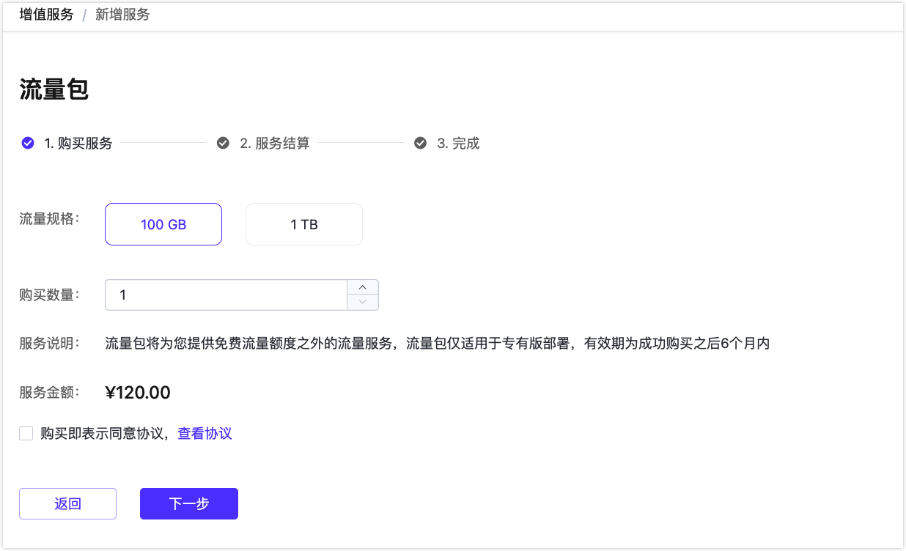
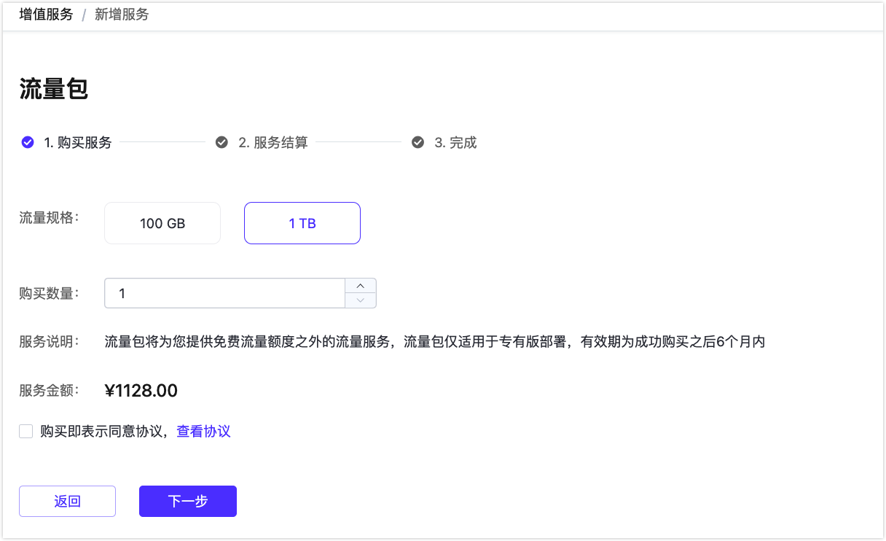
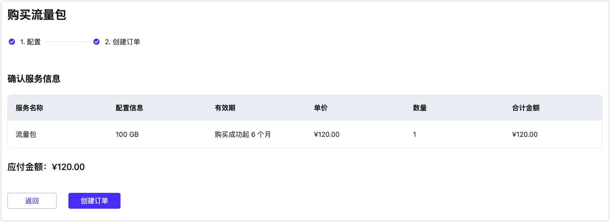
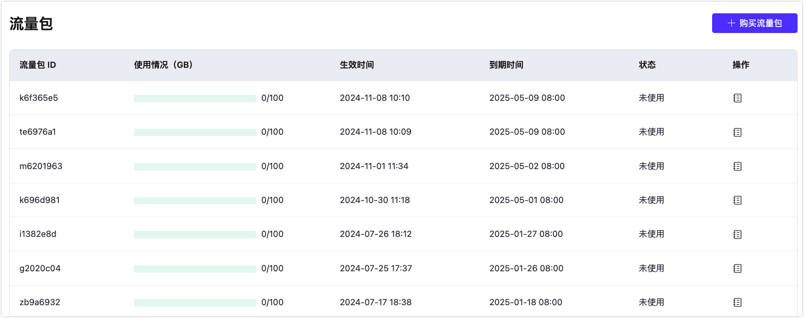

# 流量包

EMQX Cloud 的定价模式是采用连接数作为主要计价衡量因素，相较于按收发消息数来为衡量单位计价会更加经济实惠，不会出现因为消息量飙升导致消费也突然升高的情况。

随着客户使用场景的逐渐丰富，我们发现低接入量高流量消耗的场景也十分常见，为了帮助节省流量费用，EMQX Cloud 推出不同规格的流量包，用户可以根据自己的实际情况选择购买。

::: tip

* 流量包为所有部署提供服务，即所有部署共享流量包
* 流量包适用范围：计时部署、包年部署。<strong>流量包不能抵消 serverless 部署产生的流量。</strong>
* 每个部署流量优先使用免费流量，超出部分开始在流量包中计算
* 若有流量包叠加的情况，优先使用到期的日期在前面的流量包

:::

## 流量包规格以及计费规则

### 规格

目前 EMQX Cloud 提供 **100 GB** 、 **1 TB** 两种规格的流量包。

每种流量包的单次购买上限为 10 个。

### 流量包的计费规则

用户可以在增值服务市场购买流量包，使用流量预购买模式，获得一定的价格优惠。

1、流量包的使用有限期为 6 个月，流量包到期后，不支持退款，到期后未用完的流量将清零，不支持转移到其他流量包。

2、流量包中流量使用完，则继续以按小时计费的方式进行流量扣费。

3、流量包的付费形式有余额支付、支付宝支付、微信支付、对公汇款。

## 流量包开通以及购买流程

1、您可以通过以下两个入口开通流量包。

方式一：登陆 EMQX Cloud 控制台，在菜单栏点击`增值服务`，选择流量包。

方式二：在部署的流量消耗处点击`购买流量包`

2、选择流量包规格、购买数量之后，同意服务协议之后，确认服务信息。

3、点击`确认购买`，进入待支付订单，选择支付方式，点击`支付`，即可成功开通流量包服务。

## 流量包详情及常看方式

在开通流量包之后，您可以通过以下方式查看详情页面。

1、找到控制台顶部菜单栏 `增值服务`，找到流量包，点击服务详情。

2、在服务详情页面可查看到流量包 ID、使用情况(GB)、生效时间、到期时间、状态。

3、点击右侧操作的详情按钮，可查看到流量包使用详情。

