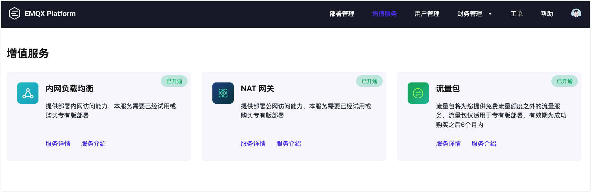

# 增值服务简介

::: warning 注意
增值服务为专有版和旗舰版功能，购买服务前需要创建专有版或旗舰版部署。
:::

增值服务是由 EMQX Platform 提供和运维的高可用服务计划，为了满足用户在技术和产品上的特殊需求。

EMQX Platform 提供的所有增值服务可以在顶部菜单栏 - **增值服务** 中找到，您可以在这里查看并开通服务。已经购买的服务会显示在增值服务页面中。一般情况下，我们会提供一段时间的免费试用，让您充分了解功能特性之后再决定是否购买。

## 增值服务试用说明
NAT 网关和内网负载均衡可提供功能试用，试用要求如下：

<table>
   <tr>
      <th>增值服务</th>
      <th>部署要求</th>
      <th>试用时间</th>
      <th>试用限制</th>
   </tr>
   <tr>
      <td>NAT 网关</td>
      <td>专有版</td>
      <td>14天</td>
      <td>一个云账号一次试用</td>
   </tr>
   <tr>
      <td>内网负载均衡</td>
      <td>专有版</td>
      <td>14天</td>
      <td>一个云账号一次试用</td>
   </tr>
</table>
