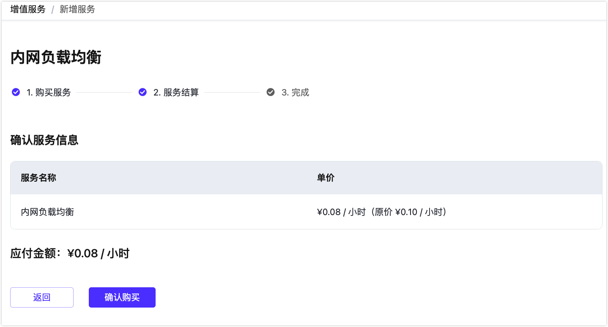

# 增值服务简介

增值服务是由 EMQX Cloud 提供和运维的高可用服务计划，为了满足用户在技术和产品上的特殊需求。

EMQX Cloud 提供的所有增值服务可以在顶部菜单栏 - `增值服务` 中找到，您可以在这里查看并开通服务。已经购买的服务会显示在我的服务中。一般情况下，我们会提供一段时间的免费试用，让您充分了解功能特性之后再决定是否购买。

增值服务是和您购买的部署关联的，在购买专有版部署之后，才可以开通相关的增值服务，请留意服务的相关说明。如果您购买了多个部署，请选择您需要创建服务实例的部署。

开通完成之后，可以查看服务列表，这里将显示您所购买的同类型的所有增值服务。或者您也可以直接前往查看在部署下的增值服务。

除了在增值服务中心开通服务之外，您在部署下的功能中，也可以看到能提供服务的入口，（不同的增值服务入口会不一样）。在这里可以直接开通此服务，流程和在增值服务中心开通一致。

## 增值服务试用说明
NAT 网关和内网负载均衡可提供功能试用，试用要求如下：

<table>
   <tr>
      <th>增值服务</th>
      <th>部署要求</th>
      <th>试用时间</th>
      <th>试用限制</th>
   </tr>
   <tr>
      <td>NAT 网关</td>
      <td>专业版</td>
      <td>14天</td>
      <td>一个云账号一次试用</td>
   </tr>
   <tr>
      <td>内网负载均衡</td>
      <td>专业版</td>
      <td>14天</td>
      <td>一个云账号一次试用</td>
   </tr>
</table>

